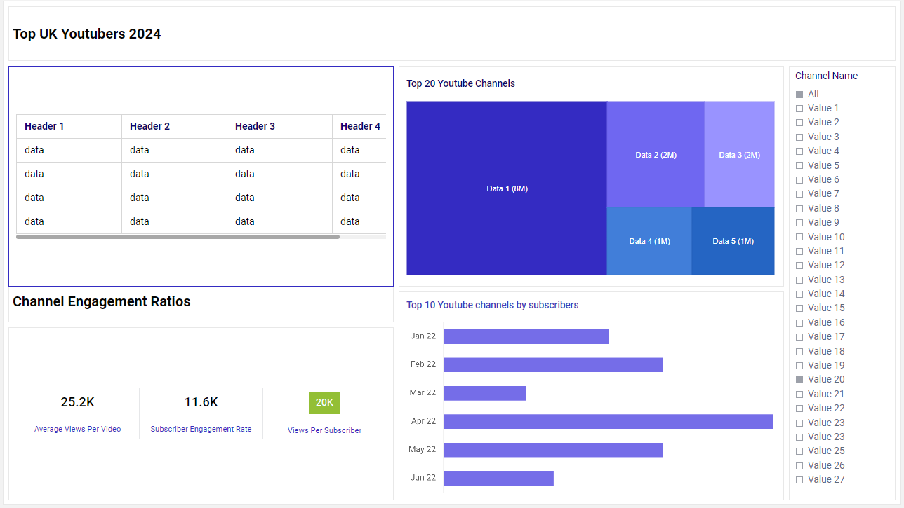

# Top UK YouTubers

# Table of Contents

- [Objective](#objective)
- [Data Source](#data-source)
- [Stages](#stages)
  - [Mockup](#mockup)
  - [Tools](#tools)
-[Development](#development)
  - [Pseudocode](#pseudocode)
  - [Data Exploration](#data-exploration)
  - [Data Cleaning](#data-cleaning)
  - [Transform the Data](#transform-the-data)
  - [Create the SQL View](#create-the-sql-view)
- [Testing](#testing)
  - [Data Quality Checks](#data-quality-checks)
- [Visualisation](#visualisation)
  - [Results](#results)
  - [DAX Measures](#dax-measures)
- [Analysis](#analysis)
  - [Findings](#findings)
  - [Validation](#validation)
  - [Discovery](#discovery)
-  [Recommendations](#recommendations)
  - [Potential ROI](#potential-roi)
  - [Potential Courses of Actions](#potential-courses-of-actions)
- [Conclusion](#conclusion) 

# Objective
* What is the key pain point?

The Head of Marketing wants to run some marketing campaigns on YouTube, however, she needs help to decide which UK YouTubers would be best to run marketing campaigns for the company throughout the rest of the year 2024.

* Ideal solution

The ideal solution would be o create a dashboard that provides relevant insights into the top UK YouTubers in 2024, that includes their;

* subscriber count
* total views
* total videos, and
* engagement metrics

This will help the marketing team make data driven decisions about which YouTubers are best to collaborate with for their marketing campaigns.

# Data Source
* What data is needed to achieve the objectives for this project?
We need data on the top UK YouTubers in 2024, which include several key information, such as;
* channel name
* total subscribers
* total views
* total videos uploaded
* the data has been sources from Kaggle, [click here to find the data](https://www.kaggle.com/datasets/bhavyadhingra00020/top-100-social-media-influencers-2024-countrywise?resource=download)

# Stages
The stages for this project will be;
* Design
* Development
* Testing
* Analysis

# Design
## Dashboard components required
* What should the dashboard contain based on the requirements provided?

To understand what the dashboard should contain, we need to figure out what questions we need the dashboard to answer, which will help provide the data to make data driven decisions for the marketing campaigns. Some of the quesions are as below:
* Who are the top 10 YouTubers based on subscriber count?
* Which channels have uploaded the most videos?
* Which channels have the most views accumulated?
* Which channels have the highest average views per video?
* Which channels have the highest views per subscriber ratio?
* Which channels have the highest subscriber engagement rate per video uploaded?

## Dashboard mockup
* What should the dashboard look like and what should it contain?

To answer the questions listed above, we can use a variety of visualisations, such as:
1. Table
2. Treemap
3. Scorecards
4. Horizontal bar chart
5. Filters



## Tools

| Tool | Purpose |
| --- | --- |
| Excel | Exploring the data |
| SQL Server | Cleaning, testing, and analysing the data |
| Power BI | Visualising the data via interactive dashboards |
| Mokkup AI | Designing the wireframe/mockup of the dashboard | 
| GitHub | Hosting the project documentation and version control |

# Development
## Tools
What is the approach you will use to create a solution from start to finish?

1. Get the data
2. Explore the data using Microsoft Excel
3. Load the data into SQL
4. Clean the data with SQL
5. Test the data with SQL
6. Visualise the data in Power Bi
7. Generate the findings based on the insights
8. Write the documentation
9. Publish the data to GitHub

## Data Exploration Notes
* What are your thoughts and observations with this dataset?
1. There are four columns which contain the data we need for this analysis, those columns being channel id, total subscribers, total views, and total videos uploaded
2. The channel id column contains the channel name and their ID, which are seperated by the @ symbol, so I will need to extract the channel name from this column
3. Some of the cells and header names are in a different language, so I need to cinfirm if these columns are needed, and if they are, how will I address them
4. We have more data than we actually need, so I can remove the unneeded data

## Data Cleaning
* What should the clean data look like?

The clean data should be structured and ready for analysis, and it should meet the following criteria and constraints:
1. Olnly relevent columns should be retained
2. All data types should be appropriate for the contents of each column
3. No NULL values in any of the columns

Below is a table outlining the constraints on our cleaned dataset:

| Property | Description |
| --- | --- |
| Number of Rows | 100 |
| Number of Columns | 4 |

Below is a tabular representation of the expected schema for the clean data:

| Column Name | Data Type | Nullable |
| --- | --- | --- |
| channel_name | VARCHAR | NO |
| total_subscribers | INTEGER | NO |
| total_views | INTEGER | NO |
| total_videos | INTEGER | NO |

* What are the steps needed to clean and shape the data into the desired format?
1. Remove unnecessary columns
2. Extract YouTube channel names from the first column
3. Rename the columns using suitable aliases

### Transforming the data
```sql
/*
# 1. Select the required columns
# 2. Extract the channel name from the 'NOMBRE' column
*/

-- 1.
SELECT
	SUBSTRING(nombre, 1, CHARINDEX('@', nombre) -1) AS channel_name,  -- 2.
	total_subscribers,
	total_videos,
	total_views
FROM top_uk_youtubers;
```
### Create the SQL view
Creating a view allows us to only work with the data we need for our analysis

```sql
/*
# 1. Create a view to store the data we have transformed
# 2. CAST the extracted channel name to the VARCHAR(100) data type
# 3. SELECT only the required columns from the top_uk_youtubers database
*/

--1.
CREATE VIEW view_uk_youtubers AS

--2.
SELECT
	CAST(SUBSTRING(nombre, 1, CHARINDEX('@', nombre) -1) AS VARCHAR(100)) AS channel_name,
	total_subscribers,
	total_views,
	total_videos

-- 3.
FROM top_uk_youtubers;
```

# Testing
Data quality and validation tests I conducted are as below:

## Row count check
### SQL Query
```sql
/*
# Count the total number of rows / records in the SQL View (Expected 100)

SELECT
	COUNT(*) as row_count
FROM view_uk_youtubers;

*/
```
### Output


## Column count check
### SQL Query
```sql
/*
# Count the total number of columns in the SQL view (Expected 4)

SELECT 
	COUNT(*) AS column_count
FROM INFORMATION_SCHEMA.COLUMNS
WHERE TABLE_NAME = 'view_uk_youtubers';
*/
```
### Output


## Data type check
### SQL Query
```sql
/*
# Checks the data type of each column from the view

SELECT 
	COLUMN_NAME,
	DATA_TYPE
FROM INFORMATION_SCHEMA.COLUMNS
WHERE TABLE_NAME = 'view_uk_youtubers';
*/
```
### Output


## Duplicate count check
### SQL Query
```sql
/*
# 1. Checks for duplicate rows in the view
# 2. Groups by the channel name
# 3. Filters for groups with more than one row

SELECT
	channel_name,
	COUNT(*) AS duplicate_count
FROM view_uk_youtubers
GROUP BY channel_name
HAVING COUNT(*) > 1;
*/
```
### Output

