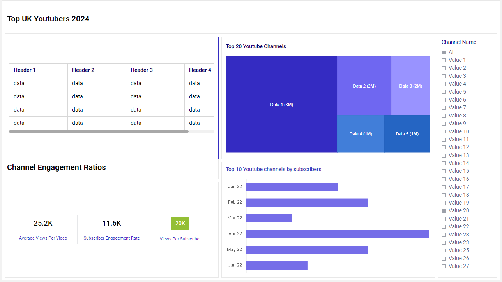

# Top UK YouTubers

# Table of Contents

- [Objective](#objective)
- [Data Source](#data-source)
- [Stages](#stages)
  - [Mockup](#mockup)
  - [Tools](#tools)
-[Development](#development)
  - [Pseudocode](#pseudocode)
  - [Data Exploration](#data-exploration)
  - [Data Cleaning](#data-cleaning)
  - [Transform the Data](#transform-the-data)
  - [Create the SQL View](#create-the-sql-view)
- [Testing](#testing)
  - [Data Quality Checks](#data-quality-checks)
- [Visualisation](#visualisation)
  - [Results](#results)
  - [DAX Measures](#dax-measures)
- [Analysis](#analysis)
  - [Findings](#findings)
  - [Validation](#validation)
  - [Discovery](#discovery)
-  [Recommendations](#recommendations)
  - [Potential ROI](#potential-roi)
  - [Potential Courses of Actions](#potential-courses-of-actions)
- [Conclusion](#conclusion) 

# Objective
* What is the key pain point?

The Head of Marketing wants to run some marketing campaigns on YouTube, however, she needs help to decide which UK YouTubers would be best to run marketing campaigns for the company throughout the rest of the year 2024.

* Ideal solution

The ideal solution would be o create a dashboard that provides relevant insights into the top UK YouTubers in 2024, that includes their;

* subscriber count
* total views
* total videos, and
* engagement metrics

This will help the marketing team make data driven decisions about which YouTubers are best to collaborate with for their marketing campaigns.

# Data Source
* What data is needed to achieve the objectives for this project?
We need data on the top UK YouTubers in 2024, which include several key information, such as;
* channel name
* total subscribers
* total views
* total videos uploaded
* the data has been sources from Kaggle, [click here to find the data](https://www.kaggle.com/datasets/bhavyadhingra00020/top-100-social-media-influencers-2024-countrywise?resource=download)

# Stages
The stages for this project will be;
* Design
* Development
* Testing
* Analysis

# Design
## Dashboard components required
* What should the dashboard contain based on the requirements provided?

To understand what the dashboard should contain, we need to figure out what questions we need the dashboard to answer, which will help provide the data to make data driven decisions for the marketing campaigns. Some of the quesions are as below:
* Who are the top 10 YouTubers based on subscriber count?
* Which channels have uploaded the most videos?
* Which channels have the most views accumulated?
* Which channels have the highest average views per video?
* Which channels have the highest views per subscriber ratio?
* Which channels have the highest subscriber engagement rate per video uploaded?

## Dashboard mockup
* What should the dashboard look like and what should it contain?

To answer the questions listed above, we can use a variety of visualisations, such as:
1. Table
2. Treemap
3. Scorecards
4. Horizontal bar chart
5. Filters

# Development

# Testing

# Analysis
