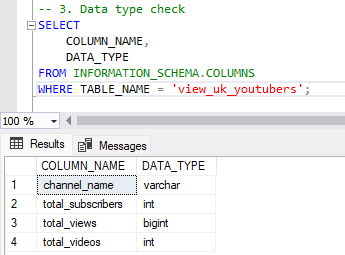
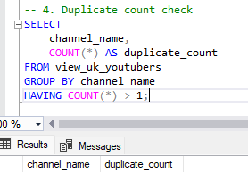

# Top UK YouTubers

# Table of Contents

- [Objective](#objective)
- [Data Source](#data-source)
- [Stages](#stages)
  - [Mockup](#mockup)
  - [Tools](#tools)
  - [Development](#development)
  - [Pseudocode](#pseudocode)
  - [Data Exploration](#data-exploration)
  - [Data Cleaning](#data-cleaning)
  - [Transform the Data](#transform-the-data)
  - [Create the SQL View](#create-the-sql-view)
- [Testing](#testing)
  - [Data Quality Checks](#data-quality-checks)
- [Visualisation](#visualisation)
  - [Results](#results)
  - [DAX Measures](#dax-measures)
- [Analysis](#analysis)
  - [Findings](#findings)
  - [Validation](#validation)
  - [Discovery](#discovery)
-  [Recommendations](#recommendations)
  - [Potential ROI](#potential-roi)
  - [Potential Courses of Actions](#potential-courses-of-actions)
- [Conclusion](#conclusion) 

# Objective
* What is the key pain point?

The Head of Marketing wants to run some marketing campaigns on YouTube, however, she needs help to decide which UK YouTubers would be best to run marketing campaigns for the company throughout the rest of the year 2024.

* Ideal solution

The ideal solution would be o create a dashboard that provides relevant insights into the top UK YouTubers in 2024, that includes their;

* subscriber count
* total views
* total videos, and
* engagement metrics

This will help the marketing team make data driven decisions about which YouTubers are best to collaborate with for their marketing campaigns.

# User story

As the Head of Marketing, I want to identify the top UK Youtubers based on their subscriber count, number of videos uploaded, and views accumulated, so that I can decide on which channels would be best to run marketing campaigns with to generate a good return on investment.

# Data Source
What data is needed to achieve the objectives for this project?
* We need data on the top UK YouTubers in 2024, which include several key information, such as;
  * channel name
  * total subscribers
  * total views
  * total videos uploaded
  * the data has been sources from Kaggle, [click here to find the data](https://www.kaggle.com/datasets/bhavyadhingra00020/top-100-social-media-influencers-2024-countrywise?resource=download)

# Stages
The stages for this project will be;
* Design
* Development
* Testing
* Analysis

# Design
## Dashboard components required
* What should the dashboard contain based on the requirements provided?

To understand what the dashboard should contain, we need to figure out what questions we need the dashboard to answer, which will help provide the data to make data driven decisions for the marketing campaigns. Some of the quesions are as below:
* Who are the top 10 YouTubers based on subscriber count?
* Which channels have uploaded the most videos?
* Which channels have the most views accumulated?
* Which channels have the highest average views per video?
* Which channels have the highest views per subscriber ratio?
* Which channels have the highest subscriber engagement rate per video uploaded?

## Dashboard mockup
* What should the dashboard look like and what should it contain?

To answer the questions listed above, we can use a variety of visualisations, such as:
1. Table
2. Treemap
3. Scorecards
4. Horizontal bar chart
5. Filters


## Tools

| Tool | Purpose |
| --- | --- |
| Excel | Exploring the data |
| SQL Server | Cleaning, testing, and analysing the data |
| Power BI | Visualising the data via interactive dashboards |
| Mokkup AI | Designing the wireframe/mockup of the dashboard | 
| GitHub | Hosting the project documentation and version control |

# Development
## Pseudocode
What is the approach you will use to create a solution from start to finish?

1. Get the data
2. Explore the data using Microsoft Excel
3. Load the data into SQL
4. Clean the data with SQL
5. Test the data with SQL
6. Visualise the data in Power Bi
7. Generate the findings based on the insights
8. Write the documentation
9. Publish the data to GitHub

## Data Exploration Notes
* What are your thoughts and observations with this dataset?
1. There are four columns which contain the data we need for this analysis, those columns being channel id, total subscribers, total views, and total videos uploaded
2. The channel id column contains the channel name and their ID, which are seperated by the @ symbol, so I will need to extract the channel name from this column
3. Some of the cells and header names are in a different language, so I need to cinfirm if these columns are needed, and if they are, how will I address them
4. We have more data than we actually need, so I can remove the unneeded data

## Data Cleaning
* What should the clean data look like?

The clean data should be structured and ready for analysis, and it should meet the following criteria and constraints:
1. Olnly relevent columns should be retained
2. All data types should be appropriate for the contents of each column
3. No NULL values in any of the columns

Below is a table outlining the constraints on our cleaned dataset:

| Property | Description |
| --- | --- |
| Number of Rows | 100 |
| Number of Columns | 4 |

Below is a tabular representation of the expected schema for the clean data:

| Column Name | Data Type | Nullable |
| --- | --- | --- |
| channel_name | VARCHAR | NO |
| total_subscribers | INTEGER | NO |
| total_views | INTEGER | NO |
| total_videos | INTEGER | NO |

* What are the steps needed to clean and shape the data into the desired format?
1. Remove unnecessary columns
2. Extract YouTube channel names from the first column
3. Rename the columns using suitable aliases

### Transforming the data
```sql
/*
# 1. Select the required columns
# 2. Extract the channel name from the 'NOMBRE' column
*/

-- 1.
SELECT
	SUBSTRING(nombre, 1, CHARINDEX('@', nombre) -1) AS channel_name,  -- 2.
	total_subscribers,
	total_videos,
	total_views
FROM top_uk_youtubers;
```
### Create the SQL view
Creating a view allows us to only work with the data we need for our analysis

```sql
/*
# 1. Create a view to store the data we have transformed
# 2. CAST the extracted channel name to the VARCHAR(100) data type
# 3. SELECT only the required columns from the top_uk_youtubers database
*/

--1.
CREATE VIEW view_uk_youtubers AS

--2.
SELECT
	CAST(SUBSTRING(nombre, 1, CHARINDEX('@', nombre) -1) AS VARCHAR(100)) AS channel_name,
	total_subscribers,
	total_views,
	total_videos

-- 3.
FROM top_uk_youtubers;
```

# Testing
Data quality and validation tests I conducted are as below:

## Row count check
### SQL Query
```sql
/*
# Count the total number of rows / records in the SQL View (Expected 100)
*/

SELECT
	COUNT(*) as row_count
FROM view_uk_youtubers;

```
### Output


## Column count check
### SQL Query
```sql
/*
# Count the total number of columns in the SQL view (Expected 4)
*/

SELECT 
	COUNT(*) AS column_count
FROM INFORMATION_SCHEMA.COLUMNS
WHERE TABLE_NAME = 'view_uk_youtubers';
```
### Output


## Data type check
### SQL Query
```sql
/*
# Checks the data type of each column from the view
*/
SELECT 
	COLUMN_NAME,
	DATA_TYPE
FROM INFORMATION_SCHEMA.COLUMNS
WHERE TABLE_NAME = 'view_uk_youtubers';

```
### Output


## Duplicate count check
### SQL Query
```sql
/*
# 1. Checks for duplicate rows in the view
# 2. Groups by the channel name
# 3. Filters for groups with more than one row
*/

SELECT
	channel_name,
	COUNT(*) AS duplicate_count
FROM view_uk_youtubers
GROUP BY channel_name
HAVING COUNT(*) > 1;

```
### Output


# Visualisation

## Results
The dashboard looks as below:


# Visualisation

### 1. Total Subscribers (M)
```sql
Total Subscriber (M) = 
 VAR Million = 1000000
 VAR sumOfSubscribers = SUM(view_uk_youtubers[total_subscribers])
 VAR totalSubscribers = DIVIDE(sumOfSubscribers,Million)

 RETURN totalSubscribers

```

### 2. Total Views (B)
```sql
Total Views (B) = 
VAR Billion = 1000000000
VAR sumOfTotalViews = SUM(view_uk_youtubers[total_views])
VAR totalViews = DIVIDE(sumOfTotalViews,Billion)

RETURN totalViews

```

### 3. Total Videos
```sql
Total Videos = 
VAR totalVideos = SUM(view_uk_youtubers[total_videos])

RETURN totalVideos

```

### 4. Average Views Per Video (M)
```sql
Avg Views per Video (M) = 
VAR sumOfTotalViews = SUM(view_uk_youtubers[total_views])
VAR sumOfTotalVideos = SUM(view_uk_youtubers[total_videos])
VAR avgViewsPerVideo = DIVIDE(sumOfTotalViews, sumOfTotalVideos, BLANK())
VAR finalAvgViewsPerVideo = DIVIDE(avgViewsPerVideo, 1000000, BLANK())

RETURN finalAvgViewsPerVideo

```

### 5. Subscriber Engagement Rate
```sql
Subscriber Engagement Rate = 
VAR sumOfTotalSubscribers = SUM(view_uk_youtubers[total_subscribers])
VAR sumOfTotalVideos = SUM(view_uk_youtubers[total_videos])
VAR subscriberEngRate = DIVIDE(sumOfTotalSubscribers, sumOfTotalVideos, BLANK())

RETURN subscriberEngRate

```

### 6. Views per subscriber
```sql
View Per Subscriber = 
VAR sumOfTotalViews = SUM(view_uk_youtubers[total_views])
VAR sumOfTotalSubscribers = SUM(view_uk_youtubers[total_subscribers])
VAR viewPerSubscriber = DIVIDE(sumOfTotalViews,sumOfTotalSubscribers,BLANK())

RETURN viewPerSubscriber

```

# Analysis 

## Findings

* What were our findings?

There were several key questions we needed to answer for our marketing client:
1. Who are the top 10 YouTubers with the most subscribers?
2. Which 3 channels have uploaded the most videos?
3. Which 3 channels have the most views?
4. Which 3 channels have the highest average views per video?
5. Which 3 channels have the highest views per subscriber ratio?
6. Which 3 channels have the highest subscriber engagement rate per video uploaded?

### 1. Who are the top 10 YouTubers with the most subscribers?

| Rank | Channel Name         | Subscribers (M) |
|------|----------------------|-----------------|
| 1    | NoCopyrightSounds    | 33.60           |
| 2    | DanTDM               | 28.60           |
| 3    | Dan Rhodes           | 26.50           |
| 4    | Miss Katy            | 24.50           |
| 5    | Mister Max           | 24.40           |
| 6    | KSI                  | 24.10           |
| 7    | Jelly                | 23.50           |
| 8    | Dua Lipa             | 23.30           |
| 9    | Sidemen              | 21.00           |
| 10   | Ali-A                | 18.90           |


### 2. Which 3 channels have uploaded the most videos?

| Rank | Channel Name    | Videos Uploaded |
|------|-----------------|-----------------|
| 1    | GRM Daily       | 14,696          |
| 2    | Manchester City | 8,248           |
| 3    | Yogscast        | 6,435           |


### 3. Which 3 channels have the most views?


| Rank | Channel Name | Total Views (B) |
|------|--------------|-----------------|
| 1    | DanTDM       | 19.78           |
| 2    | Dan Rhodes   | 18.56           |
| 3    | Mister Max   | 15.97           |


### 4. Which 3 channels have the highest average views per video?

| Channel Name | Averge Views per Video (M) |
|--------------|-----------------|
| Mark Ronson  | 32.27           |
| Jessie J     | 5.97            |
| Dua Lipa     | 5.76            |


### 5. Which 3 channels have the highest views per subscriber ratio?

| Rank | Channel Name       | Views per Subscriber        |
|------|-----------------   |---------------------------- |
| 1    | GRM Daily          | 1185.79                     |
| 2    | Nickelodeon        | 1061.04                     |
| 3    | Disney Junior UK   | 1031.97                     |


### 6. Which 3 channels have the highest subscriber engagement rate per video uploaded?

| Rank | Channel Name    | Subscriber Engagement Rate  |
|------|-----------------|---------------------------- |
| 1    | Mark Ronson     | 343,000                     |
| 2    | Jessie J        | 110,416.67                  |
| 3    | Dua Lipa        | 104,954.95                  |


## Validation 

### 1. Youtubers with the most subscribers 

#### Calculation breakdown

Campaign idea = product placement 

1. NoCopyrightSounds 
- Average views per video = 6.92 million
- Product cost = $5
- Potential units sold per video = 6.92 million x 2% conversion rate = 138,400 units sold
- Potential revenue per video = 138,400 x $5 = $692,000
- Campaign cost (one-time fee) = $50,000
- **Net profit = $692,000 - $50,000 = $642,000**

b. DanTDM

- Average views per video = 5.34 million
- Product cost = $5
- Potential units sold per video = 5.34 million x 2% conversion rate = 106,800 units sold
- Potential revenue per video = 106,800 x $5 = $534,000
- Campaign cost (one-time fee) = $50,000
- **Net profit = $534,000 - $50,000 = $484,000**

c. Dan Rhodes

- Average views per video = 11.15 million
- Product cost = $5
- Potential units sold per video = 11.15 million x 2% conversion rate = 223,000 units sold
- Potential revenue per video = 223,000 x $5 = $1,115,000
- Campaign cost (one-time fee) = $50,000
- **Net profit = $1,115,000 - $50,000 = $1,065,000**


Best option from category: Dan Rhodes

#### SQL query 

```sql
/* 

# 1. Define variables 
# 2. Create a CTE that rounds the average views per video 
# 3. Select the column you need and create calculated columns from existing ones 
# 4. Filter results by Youtube channels
# 5. Sort results by net profits (from highest to lowest)

*/


-- 1. Defining the variables
DECLARE @conversionRate FLOAT = 0.02;			-- Conversion rate at 2%
DECLARE @productCost MONEY = 5.0;			-- Product cost at $5
DECLARE @campaignCost MONEY = 50000.0;			-- Campaign cost at $50,000

-- 2.
WITH ChannelData AS (
    SELECT
        channel_name,
        total_videos,
        total_views,
        ROUND((CAST(total_views AS FLOAT) / total_videos), -4) AS rounded_avg_views_per_video
    FROM view_uk_youtubers
)

-- 3. Select columns appropriate for the analsis
SELECT
	channel_name,
	rounded_avg_views_per_video,
	(rounded_avg_views_per_video * @conversionRate) AS potential_product_sales_per_video,
	(rounded_avg_views_per_video * @conversionRate * @productCost) AS potential_revenue_per_video,
	(rounded_avg_views_per_video * @conversionRate * @productCost) - @campaignCost AS net_profit
FROM ChannelData
-- 4.
WHERE channel_name IN ('NoCopyRightSounds', 'DanTDM', 'Dan Rhodes')
--5.
ORDER BY net_profit DESC;

```

#### Output


### 2. Youtubers with the most videos uploaded

### Calculation breakdown 

Campaign idea = sponsored video series  

1. GRM Daily
- Average views per video = 510,000
- Product cost = $5
- Potential units sold per video = 510,000 x 2% conversion rate = 10,200 units sold
- Potential revenue per video = 10,200 x $5= $51,000
- Campaign cost (11-videos @ $5,000 each) = $55,000
- **Net profit = $51,000 - $55,000 = -$4,000 (potential loss)**

b. **Manchester City**

- Average views per video = 240,000
- Product cost = $5
- Potential units sold per video = 240,000 x 2% conversion rate = 4,800 units sold
- Potential revenue per video = 4,800 x $5= $24,000
- Campaign cost (11-videos @ $5,000 each) = $55,000
- **Net profit = $24,000 - $55,000 = -$31,000 (potential loss)**

b. **Yogscast**

- Average views per video = 710,000
- Product cost = $5
- Potential units sold per video = 710,000 x 2% conversion rate = 14,200 units sold
- Potential revenue per video = 14,200 x $5= $71,000
- Campaign cost (11-videos @ $5,000 each) = $55,000
- **Net profit = $71,000 - $55,000 = $16,000 (profit)**


Best option from category: Yogscast

#### SQL query 
```sql
/* Total Video Analysis

1. Define the variables
2. Create a CTE that rounds the averages views per video
3. Select columns appropriate for the analysis
4. Filter results by the YouTube channels with the highest number of videos uploaded
5. Order by net_profit (from highest to lowest)

*/

DECLARE @conversionRate FLOAT = 0.02;		-- Conversion rate at 2%
DECLARE @productCost MONEY = 5.0;			-- Product cost at $5
DECLARE @campaignCost MONEY = 55000.0;	-- Campaign cost at $50,000

-- 2.
WITH ChannelData AS (
    SELECT
        channel_name,
        total_videos,
        total_views,
        ROUND((CAST(total_views AS FLOAT) / total_videos), -4) AS rounded_avg_views_per_video
    FROM view_uk_youtubers
)

-- 3. Select columns appropriate for the analysis
SELECT
	channel_name,
	rounded_avg_views_per_video,
	(rounded_avg_views_per_video * @conversionRate) AS potential_product_sales_per_video,
	(rounded_avg_views_per_video * @conversionRate * @productCost) AS potential_revenue_per_video,
	(rounded_avg_views_per_video * @conversionRate * @productCost) - @campaignCost AS net_profit
FROM ChannelData
-- 4.
WHERE channel_name IN ('GRM Daily', 'Man City', 'YOGSCAST Lewis & Simon')
--5.
ORDER BY net_profit DESC;

```

#### Output


### 3.  Youtubers with the most views 

#### Calculation breakdown

Campaign idea = Influencer marketing 

a. DanTDM

- Average views per video = 5.34 million
- Product cost = $5
- Potential units sold per video = 5.34 million x 2% conversion rate = 106,800 units sold
- Potential revenue per video = 106,800 x $5 = $534,000
- Campaign cost (3-month contract) = $130,000
- **Net profit = $534,000 - $130,000 = $404,000**

b. Dan Rhodes

- Average views per video = 11.15 million
- Product cost = $5
- Potential units sold per video = 11.15 million x 2% conversion rate = 223,000 units sold
- Potential revenue per video = 223,000 x $5 = $1,115,000
- Campaign cost (3-month contract) = $130,000
- **Net profit = $1,115,000 - $130,000 = $985,000**

c. Mister Max

- Average views per video = 14.06 million
- Product cost = $5
- Potential units sold per video = 14.06 million x 2% conversion rate = 281,200 units sold
- Potential revenue per video = 281,200 x $5 = $1,406,000
- Campaign cost (3-month contract) = $130,000
- **Net profit = $1,406,000 - $130,000 = $1,276,000**

Best option from category: Mister Max


#### SQL query 
```sql
/* Total Views Analysis

1. Define the variables
2. Create a CTE that rounds the averages views per video
3. Select columns appropriate for the analysis
4. Filter results by the YouTube channels with the highest number of views
5. Order by net_profit (from highest to lowest)

*/

DECLARE @conversionRate FLOAT = 0.02;		-- Conversion rate at 2%
DECLARE @productCost MONEY = 5.0;			-- Product cost at $5
DECLARE @campaignCost MONEY = 130000.0;	-- Campaign cost at $50,000

-- 2.
WITH ChannelData AS (
    SELECT
        channel_name,
        total_videos,
        total_views,
        ROUND((CAST(total_views AS FLOAT) / total_videos), -4) AS rounded_avg_views_per_video
    FROM view_uk_youtubers
)

-- 3. Select columns appropriate for the analysis
SELECT
	channel_name,
	rounded_avg_views_per_video,
	(rounded_avg_views_per_video * @conversionRate) AS potential_product_sales_per_video,
	(rounded_avg_views_per_video * @conversionRate * @productCost) AS potential_revenue_per_video,
	(rounded_avg_views_per_video * @conversionRate * @productCost) - @campaignCost AS net_profit
FROM ChannelData
-- 4.
WHERE channel_name IN ('Dan Rhodes', 'DanTDM', 'Mister Max')
--5.
ORDER BY net_profit DESC;

```

#### Output


## Discovery

* What did we learn?

We discovered that 


1. NoCopyrightSOunds, Dan Rhodes and DanTDM are the channnels with the most subscribers in the UK
2. GRM Daily, Man City and Yogscast are the channels with the most videos uploaded
3. DanTDM, Dan Rhodes and Mister Max are the channels with the most views

## Recommendations 

* What do you recommend based on the insights gathered?

1. Dan Rhodes is the best YouTube channel to collaborate with as he has the third most subscribers (25.5M), but he has the second most highest total views (18.56B), and is expected to generate the most net profit from the product placement campaign.
2. GRM Daily, Man City and Yogscast are the three channels with the most uploads, however, the expected ROI from these channels are not worth the effort, so it may not be suitable for the marketing department to advance with any of these three YouTubers.
3. Mister Max averages 14.06M views per video and the potential net profit we would generate from advancing with him would be $1.27M, so advancing with him could be hugely beneficial for the organisation.
4. The top 3 channels to form collaborations with are Mister Max, DanTDM and Dan Rhodes based on this analysis, because they attract the most engagement on their channels consistently.

### Potential ROI 
* What ROI do we expect if we take this course of action?

1. Setting up a collaboration deal with Dan Rhodes would make the client a net profit of $1,065,000 per video
2. An influencer marketing contract with Mister Max can see the client generate a net profit of $1,276,000
3. If we go with a product placement campaign with DanTDM, this could  generate the client approximately $484,000 per video. If we advance with an influencer marketing campaign deal instead, this would make the client a one-off net profit of $404,000.
4. NoCopyrightSounds could profit the client $642,000 per video too (which is worth considering)

### Action plan
* What course of action should we take and why?

Based on our analysis, we beieve the best channel to advance a long-term partnership deal with to promote the client's products is the Dan Rhodes channel. 

We'll have conversations with the marketing client to forecast what they also expect from this collaboration. Once we observe we're hitting the expected milestones, we'll advance with potential partnerships with DanTDM, Mister Max and NoCopyrightSounds channels in the future.   

* What steps do we take to implement the recommended decisions effectively?

1. Reach out to the teams behind each of these channels, starting with Dan Rhodes
2. Negotiate contracts within the budgets allocated to each marketing campaign
3. Kick off the campaigns and track each of their performances against the KPIs
4. Review how the campaigns have gone, gather insights and optimize based on feedback from converted customers and each channel's audiences 
